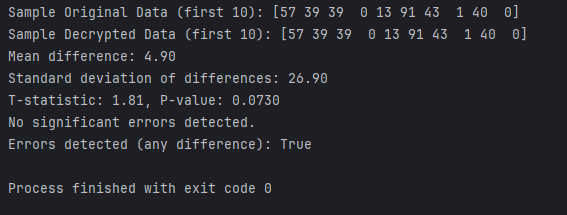

# Scientific Data Encryption Analyzer

  

A Python tool that simulates XOR encryption on sample scientific datasets, introduces random transmission errors, and uses NumPy and SciPy to perform statistical analysis for detecting data integrity issues.

This repo shows lightweight encryption techniques combined with statistical error detection, with potential applications in protecting and validating scientific data (e.g., sensor readings, simulation outputs) in computational research environments.

## Key Features
- Generates sample scientific data (e.g., random measurements)
- Applies simple XOR encryption/decryption
- Simulates transmission errors (bit flips at a configurable rate)
- Analyzes differences using NumPy (mean, standard deviation) and SciPy (one-sample t-test)
- Gives a clear error detection output

## Technologies Used
- Python
- NumPy
- SciPy

## Installation

1. Clone the repository:
   ```bash
   git clone https://github.com/Sequence9/Scientific-Data-Encryption-Analyzer.git
   cd Scientific-Data-Encryption-Analyzer

2. Install dependencies:
   ```bash
   pip install numpy scipy

## Usage
```bash
python analyzer.py
```
## Example Output
```bash
Sample Original Data (first 10): [42 87 12 95 63  8 76 34 51 29]
Sample Decrypted Data (first 10): [42 87 12 95 63  8 76 34 51 29]
Mean difference: 7.00
Standard deviation of differences: 37.11
T-statistic: 1.88, P-value: 0.0635
No significant errors detected.
Errors detected (any difference): True
```
*Results will vary due to randomness.*

## Future Enhancements
- Add Matplotlib visualizations of data differences
- Support loading real datasets from files
- Configurable error rates via command-line arguments
